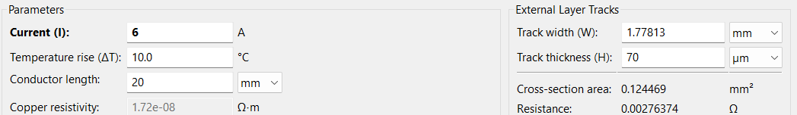
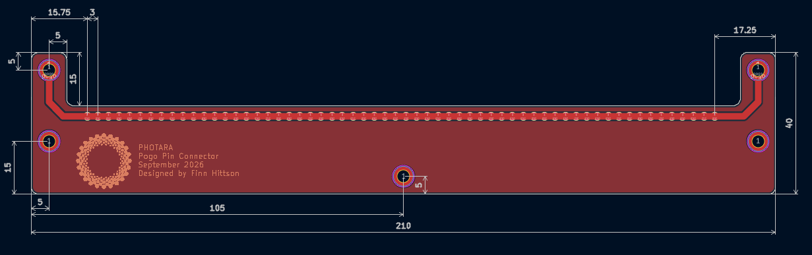

# Pogo Pin Connector

The pogo pin connector (PPC) board is used to help record the IR emissions of a solar cell when connected backwards. The board is first connect to the lines of the cell, current is injected from a power supply, and an IR camera captures the IR emissions from the cell. The PPC board is used on either side of the cell to provide a path for the current to flow. Before the PPC board, cells were tested by clamping two aluminum blocks to the exposed lines. This resulted in issues since some of the lines had better contact than others as was evident in the resulting IR image. The pogo pins are meant to apply even pressure and contact to all of the exposed lines and give a better IR image. 

## Schematic

The following image is the schematic of the PPC board. The two mounting holes, H1 and H2, are size M3 and will screw in two ring terminals that connect to a power supply. There are then sixty pogo pins connected in series between the two mounting holes. 

## PCB Layout

The following images is the PCB layout of the PPC board. The two holes at the top are the ring connectors that supply power to the pogo pins. There are three plated mounting holes to connect the physical board to a jig. The mounting holes are plated to help prevent board damage when the board is screwed in tightly.

When connected, the panel is expected to draw around four amps. The trace connecting the input to all of the pogo pins is sized for six amps: a 1.5 safety factor. Using the KiCad calculator for 2oz copper (70um tall), the trace needs to be ~1.8mm thick to be able to handle six amps.

The rest of the board is filled with copper to help with thermal management. The copper pour is not grounded but this is not expected to be an issue since the board is working with only DC supplies and no alternating or high frequency signals. The pogo pins are spaced 3mm apart and are 0.75mm offset left from the center of the board. The following image shows the dimensions of the board along with the pogo pins and mounting holes. All numbers listed are in mm. 

